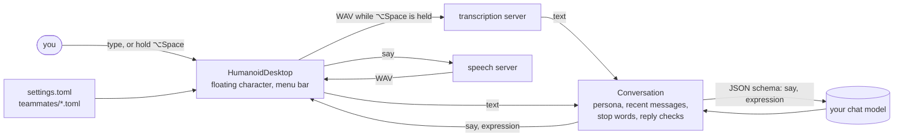

# humanoid-desktop

[](https://github.com/YauhenBichel/humanoid-desktop/actions/workflows/tests.yml)
[](LICENSE)


A humanoid teammate on your Mac desktop. A small robot character floats above your windows,
blinks, looks around and reacts. Click it and type, or hold **⌥Space** and just speak: it answers
with its face, a speech bubble and its voice. The model behind it is **one you run yourself**.

| | Byte | Tempo |
|---|---|---|
| **For** | explaining computer science: algorithms, data structures, complexity, one idea at a time | music: songs, styles, rhythm, what a song is about |
| **Looks** | green face, antenna | pink face, headphones |
| **Voice** | Kokoro `af_heart` | Kokoro `af_bella` |

Or [make your own](#make-your-own-teammate) with a small file. The characters and the file format are
shared with [humanoid-companion](https://github.com/YauhenBichel/humanoid-companion), a simulated humanoid
that walks, gestures and talks, so a teammate you make works in both.

## Install

macOS 14 or later, with Xcode or the Swift 6 command-line tools.

```bash
git clone https://github.com/YauhenBichel/humanoid-desktop && cd humanoid-desktop
scripts/build-app.sh --install        # builds HumanoidDesktop.app into ~/Applications
open ~/Applications/HumanoidDesktop.app
```

The robot appears in the bottom-right corner (drag it anywhere; it stays there), and a smiling face
appears in the menu bar. The app is signed ad hoc for your Mac; macOS asks once for the microphone the
first time you hold ⌥Space.

## Connect it to your servers

The teammate needs three OpenAI-compatible servers. They can all be on your Mac:

| What | API | For example |
|---|---|---|
| Chat | `/v1/chat/completions` with JSON-schema answers | [Ollama](https://ollama.com): `ollama pull llama3.1:8b` |
| Speech | `/v1/audio/speech` | [Kokoro-FastAPI](https://github.com/remsky/Kokoro-FastAPI): `docker run -p 8880:8880 ghcr.io/remsky/kokoro-fastapi-cpu` |
| Hearing | `/v1/audio/transcriptions` | [Speaches](https://github.com/speaches-ai/speaches) (Whisper) on port 8000 |

Menu bar → **Open Settings File…** creates `~/.config/humanoid-companion/settings.toml` and shows it
in Finder. Fill in what differs from the defaults, then **Reload Settings and Teammates**:

```toml
[user]
name = "Alex"                                  # the teammate calls you by it

[llm]
base_url = "http://127.0.0.1:11434/v1"         # Ollama
model = "llama3.1:8b"

[voice]
tts_base_url = "http://127.0.0.1:8880/v1"      # Kokoro
stt_base_url = "http://127.0.0.1:8000/v1"      # Speaches
```

A router in front of several models works too, as long as it speaks these APIs. Without a speech
server the teammate still answers, in the bubble only. API keys don't go in the file: a hosted chat
API reads `HUMANOID_LLM_API_KEY` from the environment.

## Use it

- **Type:** click the robot, write, press Return. Esc closes the field.
- **Talk:** hold ⌥Space, speak, let go.
- **Switch teammates, hide or show, quit:** the menu bar item.
- **Quiet:** "stop" or "be quiet" never reaches the model. The teammate just stops.

It can't see your screen, open apps or browse the web, and it says so.

## Make your own teammate

A teammate is a TOML file in `~/.config/humanoid-companion/teammates/`. The file name is its key.
Start from Byte or Tempo and change what you like:

```toml
# ~/.config/humanoid-companion/teammates/nova.toml
name = "Nova"
tagline = "tells stories about space"
based_on = "byte"
accessory = "none"                 # antenna, headphones or none
voice = "af_sky"                   # a voice your speech server knows
resting_expression = "happy"       # neutral, happy, thinking, surprised, sad, listening or sleeping
role = "Your role: you tell short, true stories about space, and you love questions about the planets."

[colours]
glow = "#9fd0ff"
background = "#05070f"
caption = "#dfeeff"
trim = "#2a3552"
```

Reload from the menu bar and pick Nova. A file with a mistake is reported under the robot, naming the
file and the field; the other teammates keep working. With humanoid-companion installed,
`humanoid-teammate new nova --from byte` writes this file for you.

## How it works



- `Sources/TeammateKit` has no user interface: the settings and teammate files, the conversation and
  its checks (the reply must match the schema, long speech is cut at a sentence, an unknown
  expression becomes neutral, and a failure gets an apology instead of silence), and the three HTTP
  clients. `swift test` covers it without any server.
- `Sources/HumanoidDesktop` is the app: a borderless floating panel on every Space, the character
  drawn with SwiftUI Canvas (the same proportions and expression table as humanoid-companion), lip
  sync from the voice's loudness, recording while the Carbon hot key is held (no Accessibility
  permission needed), and the menu bar item.

Stored on your Mac: the chosen teammate and the window position (user defaults). Recordings are sent
only to your transcription server and deleted right after.

## Develop

```bash
swift test                                              # no servers needed
HUMANOID_LIVE_SERVERS=1 swift test --filter LiveServer  # against the servers in your settings.toml
swift run HumanoidDesktop                               # run without building the .app (no microphone)
```

## Contributors

<!-- readme: contributors,bots/- -start -->
<!-- readme: contributors,bots/- -end -->

## Licence and disclaimer

Apache-2.0 ([LICENSE](LICENSE)). Not affiliated with Apple.

The teammate is a language model with a face. It can be wrong, so check what matters. It is not a
medical, therapy or care product and must not be used as one.
