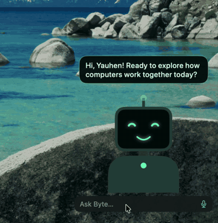
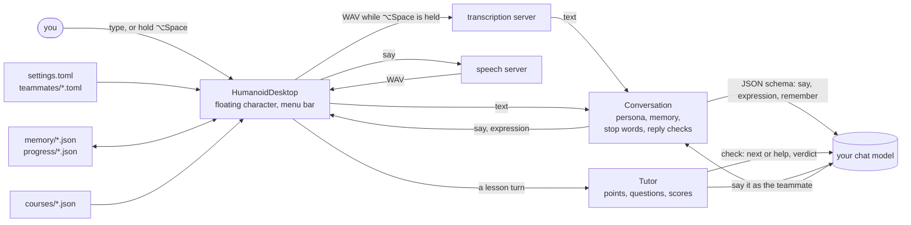

# humanoid-desktop

[](https://github.com/YauhenBichel/humanoid-desktop/actions/workflows/tests.yml)
[](LICENSE)


A humanoid teammate on your Mac desktop. A small robot character floats above your windows,
blinks, looks around and reacts. Click it and type, or hold **⌥Space** and just speak: it answers
with its face, a speech bubble and its voice. The model behind it is **one you choose**.

<p align="center">
  
</p>

**[Website](https://yauhenbichel.github.io/humanoid-desktop/)** · [demo video](docs/media/demo.mp4) (27 s, silent; the typing is sped up in the GIF)

| | Byte | Tempo |
|---|---|---|
| **For** | explaining computer science: algorithms, data structures, complexity, one idea at a time; teaches a course with quizzes | music: songs, styles, rhythm, what a song is about |
| **Looks** | green face, antenna | pink face, headphones |
| **Voice** | Kokoro `af_heart` | Kokoro `af_bella` |

Or [make your own](#make-your-own-teammate) with a small file. The characters and the file format are
shared with [humanoid-companion](https://github.com/YauhenBichel/humanoid-companion), a simulated humanoid
that walks, gestures and talks, so a teammate you make works in both.

## Install

macOS 14 or later, with Xcode or the Swift 6 command-line tools.

```bash
git clone https://github.com/YauhenBichel/humanoid-desktop && cd humanoid-desktop
scripts/build-app.sh --install        # builds HumanoidDesktop.app into ~/Applications
open ~/Applications/HumanoidDesktop.app
```

The robot appears in the bottom-right corner (drag it anywhere; it stays there), and a smiling face
appears in the menu bar. The app is signed ad hoc for your Mac; macOS asks once for the microphone the
first time you hold ⌥Space.

## Connect it to your servers

The teammate needs three OpenAI-compatible servers. They can all be on your Mac:

| What | API | For example |
|---|---|---|
| Chat | `/v1/chat/completions` with JSON-schema answers | [Ollama](https://ollama.com): `ollama pull llama3.1:8b` |
| Speech | `/v1/audio/speech` | [Kokoro-FastAPI](https://github.com/remsky/Kokoro-FastAPI): `docker run -p 8880:8880 ghcr.io/remsky/kokoro-fastapi-cpu` |
| Hearing | `/v1/audio/transcriptions` | [Speaches](https://github.com/speaches-ai/speaches) (Whisper) on port 8000 |

Menu bar → **Open Settings File…** creates `~/.config/humanoid-companion/settings.toml` and shows it
in Finder. Fill in what differs from the defaults, then **Reload Settings and Teammates**:

```toml
[user]
name = "Alex"                                  # the teammate calls you by it

[llm]
base_url = "http://127.0.0.1:11434/v1"         # Ollama
model = "llama3.1:8b"

[voice]
tts_base_url = "http://127.0.0.1:8880/v1"      # Kokoro
stt_base_url = "http://127.0.0.1:8000/v1"      # Speaches
```

A router in front of several models works too, as long as it speaks these APIs. Without a speech
server the teammate still answers, in the bubble only. API keys don't go in the file: a hosted chat
API reads `HUMANOID_LLM_API_KEY` from the environment.

## Use it

- **Type:** click the robot, write, press Return. Esc closes the field.
- **Talk:** hold ⌥Space, speak, let go. If another app already uses ⌥Space, typing still works.
- **Close:** hover over the robot and click ×, or right-click it. Bring it back from the menu bar item.
- **Switch teammates, open settings, reload, quit:** right-click the robot, or use the menu bar item.
- **Quiet:** "stop" or "be quiet" never reaches the model. The teammate just stops.
- **Memory:** each teammate remembers what you tell it about yourself ("preparing for an interview in
  November", "prefers Python") and your last few messages, across launches. **Forget What Byte
  Remembers…** in the menu bar item or the right-click menu deletes it.

It can't see your screen, open apps or browse the web, and it says so.

## Learn with Byte

Byte teaches a short course, **Computer science foundations**: Big-O notation, arrays and linked lists,
stacks and queues, hash tables, binary search, recursion, graphs (BFS and DFS) and sorting.

- **Start:** **Lessons: … → Next Lesson** in the menu bar item or the right-click menu, or pick any lesson.
- **A lesson:** Byte explains each point with an example and checks you follow. Say "ok" or "next" to go
  on, or ask about the point. Then come three short questions: answer by typing or speaking.
- **Checking:** each answer is judged against the course's own answer, as right, partly right or not right,
  and Byte says what was missing. At the end you hear your score, for example "2 of 3 right".
- **Review:** questions come back on a schedule. A wrong answer returns in 10 minutes. A right one returns
  after a day, then after 3, 7 and 21 days. **Review N Due Questions** asks up to five of the oldest.
- **Continuity:** your progress is kept in `progress/<course>.json`. In ordinary chat, Byte knows which
  lessons you finished and whether a review is due.

The questions are read out word for word. The decisions (do you follow, is the answer right) come from a
separate, strict check without Byte's cheerful persona. Byte then says the result in its own voice.

**Your own course:** put a JSON file in `~/.config/humanoid-companion/courses/`, named after its key, and
set `course = "<key>"` in a teammate's file:

```json
{
  "key": "astronomy",
  "title": "The night sky",
  "lessons": [
    {
      "key": "moon-phases",
      "title": "Moon phases",
      "goal": "Explain why the Moon's shape seems to change.",
      "points": ["The Moon shines by reflected sunlight: we always see its lit half from a changing angle."],
      "questions": [
        {"key": "q1", "ask": "Why does the Moon look different through the month?",
         "answer": "We see different parts of its sunlit half as it orbits Earth; it is not Earth's shadow."}
      ]
    }
  ]
}
```

A course with a mistake is reported under the robot, naming the file and the lesson.

## Make your own teammate

A teammate is a TOML file in `~/.config/humanoid-companion/teammates/`. The file name is its key.
Start from Byte or Tempo and change what you like:

```toml
# ~/.config/humanoid-companion/teammates/nova.toml
name = "Nova"
tagline = "tells stories about space"
based_on = "byte"
accessory = "none"                 # antenna, headphones or none
voice = "af_sky"                   # a voice your speech server knows
resting_expression = "happy"       # neutral, happy, thinking, surprised, sad, listening or sleeping
role = "Your role: you tell short, true stories about space, and you love questions about the planets."

[voices]                           # optional: a voice per answer language
de = "af_heart"

[colours]
glow = "#9fd0ff"
background = "#05070f"
caption = "#dfeeff"
trim = "#2a3552"
```

Reload from the menu bar and pick Nova. A file with a mistake is reported under the robot, naming the
file and the field; the other teammates keep working. With humanoid-companion installed,
`humanoid-teammate new nova --from byte` writes this file for you.

## Languages

**The teammate's replies:** set `language` and it answers in that language, whatever you type or say:

```toml
[user]
name = "Alex"
language = "de"          # any ISO 639-1 code; leave it out to answer in the language you use
```

- **Voices:** a teammate speaks with its own voice. Give it a voice per language in its file
  (`[voices]` with `de = "..."`, see below), using voices your speech server has.
- **Stop words:** they work in English and in the answer language ("stopp", "хопіць", "silencio", …).

**The app's menus and messages:** these come from `Sources/HumanoidDesktop/Resources/<language>.lproj/Localizable.strings`.
English is included. To add a language, copy `en.lproj` to, for example, `de.lproj` and translate the values.
macOS then shows it to people whose system language it is.

## Platforms

| Part | macOS | Linux | Windows |
|---|---|---|---|
| `TeammateKit` (settings, teammates, conversation, languages, clients) | built and tested in CI | built and tested in CI | written to build; not yet tested ([#11](https://github.com/YauhenBichel/humanoid-desktop/issues/11)) |
| The desktop app (floating character, menu bar, voice) | yes | not yet ([#12](https://github.com/YauhenBichel/humanoid-desktop/issues/12)) | not yet ([#12](https://github.com/YauhenBichel/humanoid-desktop/issues/12)) |

Everything platform-specific stays in the app target. `TeammateKit` never mentions a menu bar, a shortcut
or a settings screen: an app on another system passes its own `SessionPhrases` and its own implementations
of the protocols in `Services.swift`. The settings folder follows each system's convention:
`~/.config/humanoid-companion` (or `$XDG_CONFIG_HOME`) on macOS and Linux, `%APPDATA%\humanoid-companion`
on Windows. `HUMANOID_CONFIG_DIR` overrides it everywhere.

## How it works



**`Sources/TeammateKit`** (no user interface, fully tested)

| Part | Job |
|---|---|
| `TeammateSession` | an `@Observable` state machine, and the only place that decides what happens next: answer, speak, listen, switch |
| `Conversation` | an actor holding the persona and the memory; stop words, reply checks, apologies; folds old messages into a summary |
| `Tutor`, `LessonChecker` | a lesson or review as steps; persona-free checks decide; the teammate speaks |
| `Course`, `StudyProgress` | course files and their checks; progress with the review schedule, and its store |
| `Memory.swift` | `TeammateMemory` (facts, summary, recent messages, with limits) and the `MemoryStore` that keeps it |
| `Services.swift` | small protocols the session depends on (chat, speech, transcription, playback, recording, the saved choice, HTTP) |
| `OpenAIClients.swift` | typed `Codable` clients for OpenAI-compatible servers |
| `TeammateLibrary`, `TeammateCatalog`, `TeammateFile`, `Toml` | the settings and teammate files |

**`Sources/HumanoidDesktop`** (the app, kept thin)

| Folder | Contents |
|---|---|
| `App/` | `AppDelegate`, the composition root that creates the real services; the floating panel; the menu bar item |
| `Views/` | the speech bubble, message field, notices and close button |
| `Character/` | `FaceAnimator` (pose per frame), `CharacterPainter` (pure drawing), one `AccessoryPainter` per accessory |
| `Platform/` | AVFoundation playback and recording, the Carbon hot key, the saved teammate choice |

The session depends on protocols, so its tests use fake servers, a fake speaker and a fake microphone.
The tests cover the timing cases too: an answer that arrives after you switched teammates is dropped,
and a tap on ⌥Space released before microphone permission arrives never starts recording. A new
accessory is a new painter, and nothing else changes. Everything builds in Swift 6 language mode with
strict concurrency checking and no warnings.

Stored on your Mac: the chosen teammate and the window position (user defaults), and each teammate's
memory in `~/.config/humanoid-companion/memory/<teammate>.json` and your lesson progress in
`progress/<course>.json`, both readable only by your account. The
memory has limits (30 facts, a short summary, the last 12 messages) and leaves your Mac only inside the
prompts sent to the chat server you configured. The model is told never to note passwords, keys,
addresses, health or money details. Recordings are sent only to your transcription server and deleted
right after.

## Develop

```bash
swift format lint --strict --recursive Sources Tests Package.swift   # style, as in CI (.swift-format)
swift format format --in-place --recursive Sources Tests Package.swift
swift test                                              # no servers needed
HUMANOID_LIVE_SERVERS=1 swift test --filter LiveServer  # against the servers in your settings.toml
swift run HumanoidDesktop                               # run without building the .app (no microphone)
```

## Contributors

<!-- readme: contributors,bots/- -start -->
<!-- readme: contributors,bots/- -end -->

## Licence and disclaimer

Apache-2.0 ([LICENSE](LICENSE)). Not affiliated with Apple.

The teammate is a language model with a face. It can be wrong, so check what matters. It is not a
medical, therapy or care product and must not be used as one.
